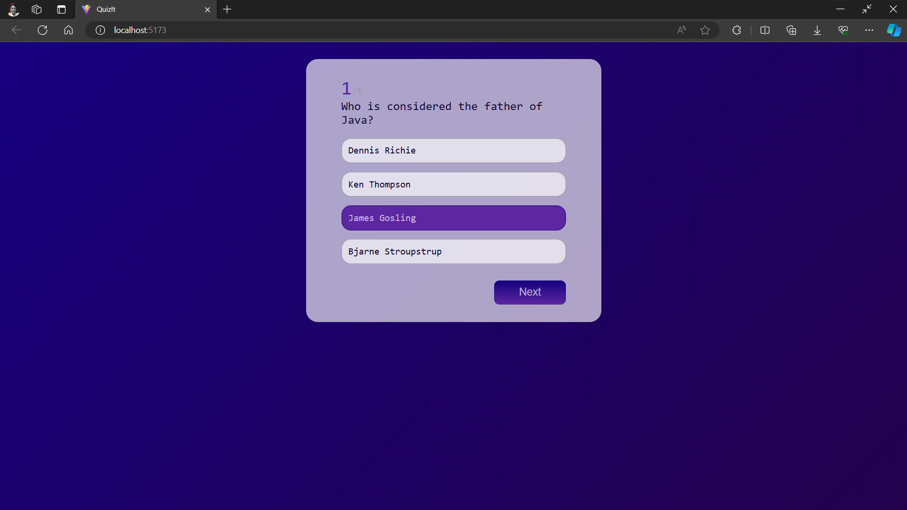

# QuizIt
### React Quiz App




## Tech Stack

**Client:** React, Css,

## Run Locally

Clone the project

```bash
  git clone https://github.com/maihunsandip/QuizIt.git
```

Go to the project directory

```bash
  cd QuizIt
```

Install dependencies

```bash
  npm install
```

Start the server

```bash
  npm run dev
```

